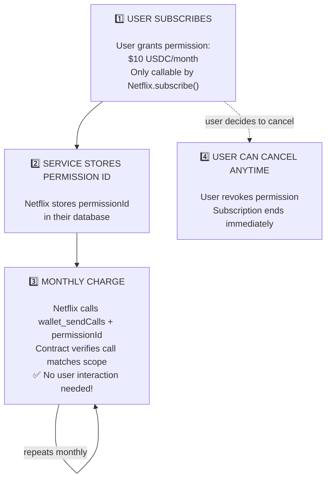

# Subscription Payments with Permissions

Learn how to implement recurring subscription payments using JAW's permission system. This enables services like Netflix, Spotify, or any SaaS to charge users automatically without requiring approval for each payment.

---

## The Problem with Traditional Crypto Payments

In traditional crypto payments, users must approve **every single transaction**. This creates a poor user experience for recurring payments:

- User subscribes to Netflix
- Every month, Netflix sends a payment request
- User must open their wallet and approve
- If user misses the approval, subscription lapses

This friction makes crypto unsuitable for subscription businesses.

---

## How Permissions Solve This

JAW's permission system (based on ERC-7715) allows users to grant **time-limited, amount-capped permissions** to service providers. The key insight is that permissions are **scoped** - they can only be used for specific actions you define.



---

## Implementation

### Installation

<Tabs items={['Wagmi', 'Core SDK']}>
<Tabs.Tab>
```bash npm2yarn
npm install @jaw.id/wagmi wagmi viem @tanstack/react-query
```
</Tabs.Tab>
<Tabs.Tab>
```bash npm2yarn
npm install @jaw.id/core viem
```
</Tabs.Tab>
</Tabs>

### Setup

<Tabs items={['Wagmi', 'Core SDK']}>
<Tabs.Tab>
```typescript
import { createConfig, http } from 'wagmi';
import { base } from 'wagmi/chains';
import { jaw } from '@jaw.id/wagmi';

export const config = createConfig({
  chains: [base],
  connectors: [
    jaw({
      apiKey: 'YOUR_API_KEY',
      appName: 'My Streaming Service',
      appLogoUrl: 'https://myservice.com/logo.png',
    }),
  ],
  transports: {
    [base.id]: http(),
  },
});
```
</Tabs.Tab>
<Tabs.Tab>
```typescript
import { JAW, Mode } from '@jaw.id/core';

const jaw = JAW.create({
  appName: 'My Streaming Service',
  appLogoUrl: 'https://myservice.com/logo.png',
  defaultChainId: 8453,
  apiKey: 'YOUR_API_KEY',
  preference: { mode: Mode.AppSpecific },
});
```
</Tabs.Tab>
</Tabs>

### 1. Grant Subscription Permission

When a user clicks "Subscribe", request a permission that allows your service to charge them periodically.

<Tabs items={['Wagmi', 'Core SDK']}>
<Tabs.Tab>
```tsx
import { useGrantPermissions } from '@jaw.id/wagmi';
import { parseUnits, type Address } from 'viem';

const SUBSCRIPTION_CONTRACT: Address = '0x...'; // Your contract
const SERVICE_SPENDER: Address = '0x...';       // Your backend wallet
const USDC_ADDRESS: Address = '0xA0b86991c6218b36c1d19D4a2e9Eb0cE3606eB48';

function SubscribeButton({ planPrice }: { planPrice: string }) {
  const { mutate: grantPermission, isPending } = useGrantPermissions();

  const handleSubscribe = () => {
    grantPermission({
      expiry: Math.floor(Date.now() / 1000) + 365 * 24 * 60 * 60, // 1 year
      spender: SERVICE_SPENDER,
      permissions: {
        spends: [{
          token: USDC_ADDRESS,
          allowance: parseUnits(planPrice, 6).toString(),
          unit: 'month',
          multiplier: 1,
        }],
        calls: [{
          target: SUBSCRIPTION_CONTRACT,
          functionSignature: 'subscribe()',
        }],
      },
    }, {
      onSuccess: (data) => {
        // Store data.permissionId in your backend!
        console.log('Permission ID:', data.permissionId);
      },
    });
  };

  return (
    <button onClick={handleSubscribe} disabled={isPending}>
      {isPending ? 'Confirming...' : `Subscribe $${planPrice}/month`}
    </button>
  );
}
```
</Tabs.Tab>
<Tabs.Tab>
```typescript
import { parseUnits, type Address } from 'viem';

const SUBSCRIPTION_CONTRACT: Address = '0x...';
const SERVICE_SPENDER: Address = '0x...';
const USDC_ADDRESS: Address = '0xA0b86991c6218b36c1d19D4a2e9Eb0cE3606eB48';

async function subscribe(userAddress: Address, planPrice: string) {
  const allowance = parseUnits(planPrice, 6);

  const result = await jaw.provider.request({
    method: 'wallet_grantPermissions',
    params: [{
      address: userAddress,
      expiry: Math.floor(Date.now() / 1000) + 365 * 24 * 60 * 60,
      spender: SERVICE_SPENDER,
      permissions: {
        spends: [{
          token: USDC_ADDRESS,
          allowance: `0x${allowance.toString(16)}`,
          unit: 'month',
          multiplier: 1,
        }],
        calls: [{
          target: SUBSCRIPTION_CONTRACT,
          functionSignature: 'subscribe()',
        }],
      },
    }],
  });

  const permissionId = (result as { permissionId: string }).permissionId;
  // Store permissionId in your backend!
  return permissionId;
}
```
</Tabs.Tab>
</Tabs>

<Callout type="info">
**Store the Permission ID**: The `permissionId` returned is required to execute charges. Save it to your backend database.
</Callout>

### 2. Execute Charge (Spender Side)

Your service charges the user using the permission ID. No user approval needed - the permission authorizes the charge.

<Tabs items={['Wagmi', 'Core SDK']}>
<Tabs.Tab>
```tsx
import { useSendCalls } from 'wagmi';
import { encodeFunctionData } from 'viem';

function ChargeSubscription({ permissionId }: { permissionId: string }) {
  const { sendCalls, isPending } = useSendCalls();

  const handleCharge = () => {
    sendCalls({
      calls: [{
        to: SUBSCRIPTION_CONTRACT,
        data: encodeFunctionData({
          abi: [{ name: 'subscribe', type: 'function', inputs: [], outputs: [] }],
          functionName: 'subscribe',
        }),
      }],
      capabilities: {
        permissions: {
          id: permissionId as `0x${string}`,
        },
      },
    });
  };

  return (
    <button onClick={handleCharge} disabled={isPending}>
      {isPending ? 'Charging...' : 'Charge Monthly Fee'}
    </button>
  );
}
```
</Tabs.Tab>
<Tabs.Tab>
```typescript
import { encodeFunctionData } from 'viem';

async function chargeSubscription(userAddress: Address, permissionId: string) {
  const result = await jaw.provider.request({
    method: 'wallet_sendCalls',
    params: [{
      version: '1.0',
      from: userAddress,
      calls: [{
        to: SUBSCRIPTION_CONTRACT,
        data: encodeFunctionData({
          abi: [{ name: 'subscribe', type: 'function', inputs: [], outputs: [] }],
          functionName: 'subscribe',
        }),
      }],
      capabilities: {
        permissions: {
          id: permissionId as `0x${string}`,
        },
      },
    }],
  });

  return (result as { id: string }).id; // batch ID
}
```
</Tabs.Tab>
</Tabs>

### 3. Cancel Subscription

Users can cancel anytime by revoking the permission. Once revoked, the spender can no longer execute charges.

<Tabs items={['Wagmi', 'Core SDK']}>
<Tabs.Tab>
```tsx
import { useRevokePermissions } from '@jaw.id/wagmi';

function CancelButton({ permissionId }: { permissionId: string }) {
  const { mutate: revokePermission, isPending } = useRevokePermissions();

  return (
    <button
      onClick={() => revokePermission({ id: permissionId as `0x${string}` })}
      disabled={isPending}
    >
      {isPending ? 'Cancelling...' : 'Cancel Subscription'}
    </button>
  );
}
```
</Tabs.Tab>
<Tabs.Tab>
```typescript
async function cancelSubscription(userAddress: Address, permissionId: string) {
  await jaw.provider.request({
    method: 'wallet_revokePermissions',
    params: [{
      address: userAddress,
      id: permissionId as `0x${string}`,
    }],
  });
}
```
</Tabs.Tab>
</Tabs>

<Callout type="info">
**Listing Permissions**: Use `usePermissions()` (Wagmi) or `wallet_getPermissions` (Core SDK) to retrieve all active permissions for a user.
</Callout>

---

## Permission Parameters Reference

| Parameter | Purpose | Example |
|-----------|---------|---------|
| `spender` | Address authorized to use this permission | Your backend wallet |
| `expiry` | Unix timestamp when permission expires | 1 year from now |
| `permissions.spends.token` | Token address to spend | USDC address |
| `permissions.spends.allowance` | Max amount per period | $10 (10000000 for USDC) |
| `permissions.spends.unit` | Time period | `month` |
| `permissions.calls.target` | Contract that can be called | Your subscription contract |
| `permissions.calls.functionSignature` | Function that can be called | `subscribe()` |

### Time Units

| Unit | Description |
|------|-------------|
| `minute` | Resets every minute |
| `hour` | Resets every hour |
| `day` | Resets every 24 hours |
| `week` | Resets every 7 days |
| `month` | Resets every ~30 days |
| `year` | Resets every 365 days |

---

## User Security Best Practices

**For users granting permissions:**

- **Check the spender address** - Is it actually Netflix's official wallet?
- **Review the call target** - Is it Netflix's verified contract?
- **Check the amount** - Does $15.99/month match the advertised price?
- **Note the expiry** - How long is this permission valid?
- **You can cancel anytime** - Revoking the permission stops all future charges

---

## Related

- [useGrantPermissions](/wagmi/useGrantPermissions) - Wagmi hook reference
- [useRevokePermissions](/wagmi/useRevokePermissions) - Cancel subscriptions
- [wallet_grantPermissions](/api-reference/wallet_grantPermissions) - RPC method reference
