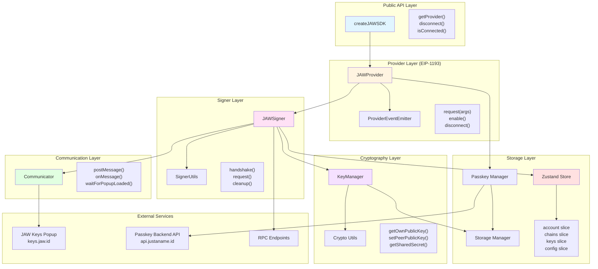
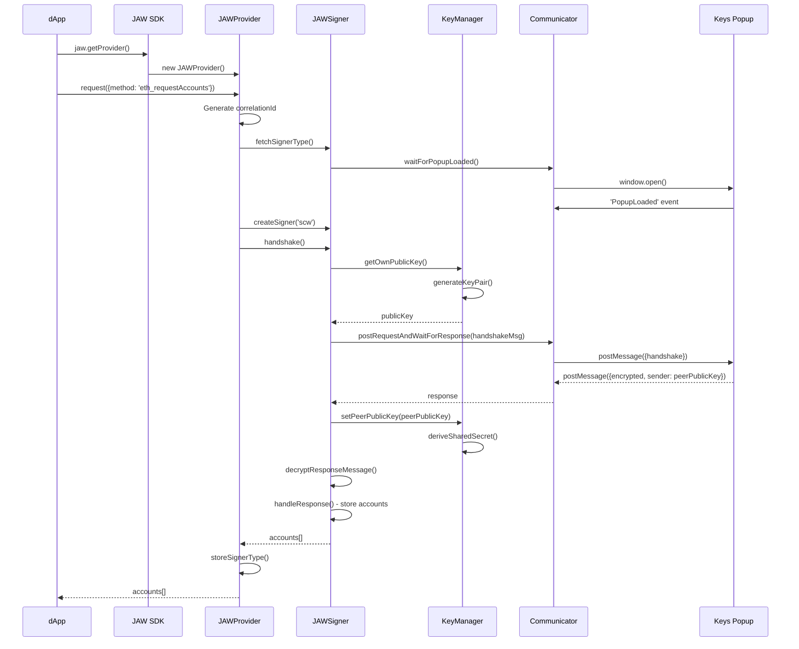
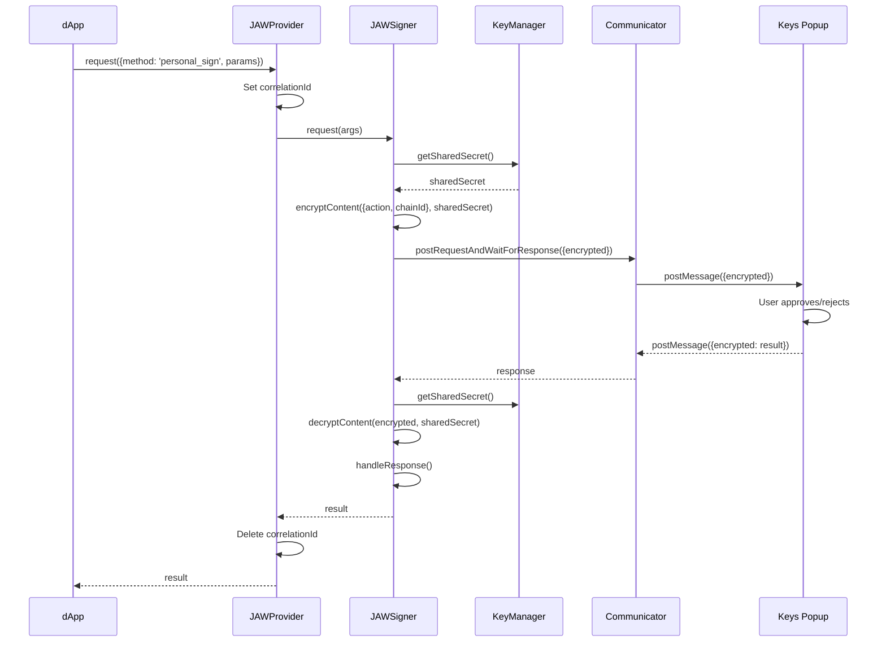
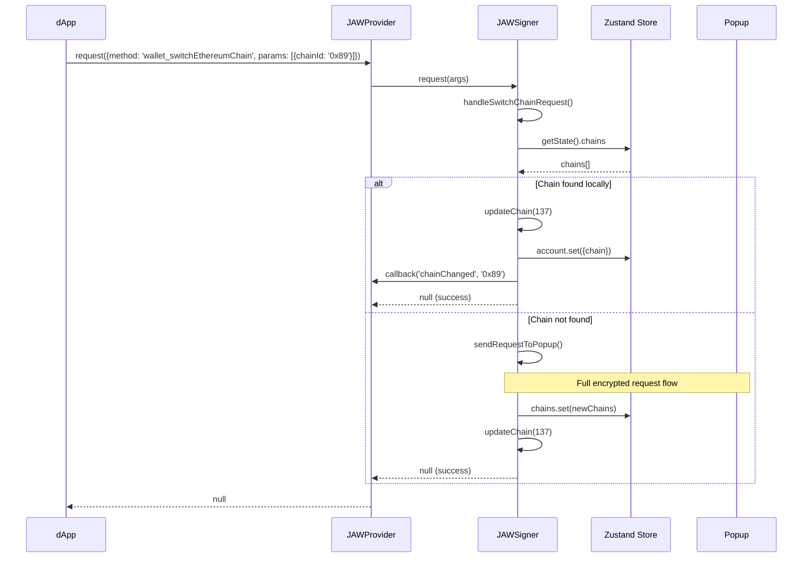
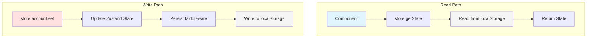
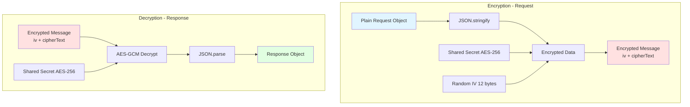
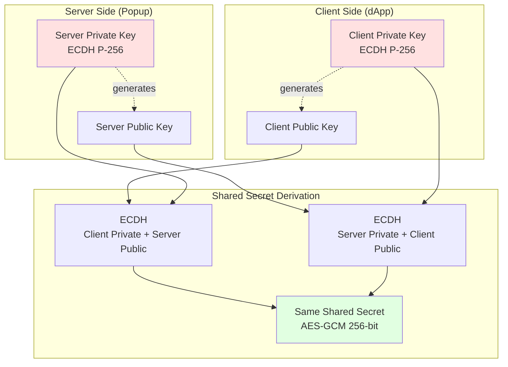
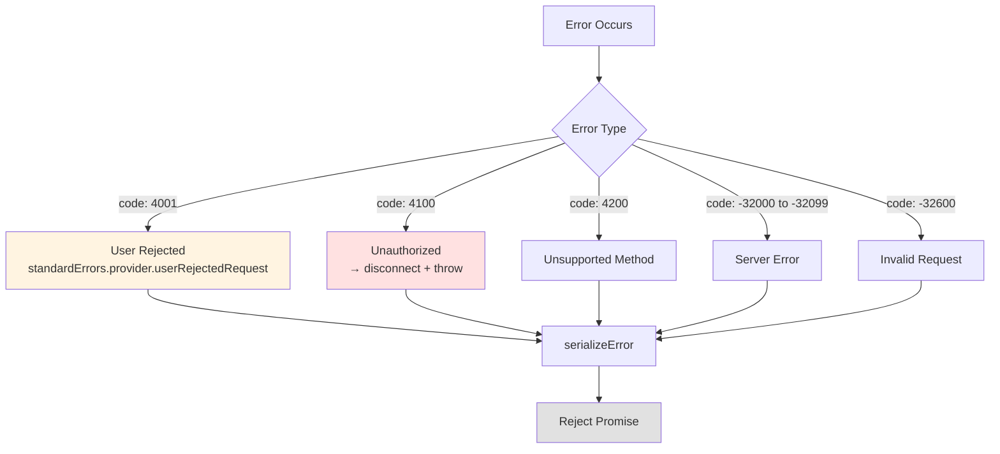

# JAW Core Package Architecture

## Overview

The JAW Core package implements an EIP-1193 compliant Ethereum provider with passkey-based authentication and end-to-end encrypted communication. It uses a layered architecture with clear separation of concerns.

## Architecture Diagram



## Component Layers

### 1. Public API Layer
**Entry Point**: `createJAWSDK(options)`
- Factory function that creates SDK instance
- Lazy initialization of provider
- Manages provider lifecycle

**Responsibilities**:
- Simple, developer-friendly interface
- Configuration management
- Provider instance management

### 2. Provider Layer (EIP-1193 Compliant)
**Main Class**: `JAWProvider`
- Implements EIP-1193 provider interface
- Event emitter for blockchain events
- Request routing and lifecycle management

**Key Features**:
- Correlation ID tracking for request lifecycle
- Automatic signer initialization
- Error serialization and handling
- Support for ephemeral signers (one-off operations)

**Request Flow**:
```
request() → _request() → signer.request() → return result
     ↓
  correlationId
  management
```

### 3. Signer Layer
**Main Class**: `JAWSigner`
- Handles authentication and request signing
- Manages encrypted communication with popup
- Multi-chain support and chain switching

**Responsibilities**:
- Session key exchange (handshake)
- Request encryption/decryption
- Account and chain state management
- RPC method routing

**Supported Flows**:
- **Authenticated**: eth_accounts, personal_sign, eth_sendTransaction, etc.
- **Unauthenticated**: wallet_connect, wallet_sendCalls, wallet_sign (ephemeral)
- **Local**: eth_chainId, net_version, wallet_switchEthereumChain

### 4. Communication Layer
**Main Class**: `Communicator`
- Manages popup window lifecycle
- PostMessage-based communication
- Origin validation and security

**Features**:
- Popup window management (center-screen positioning)
- Message routing with correlation IDs
- Event listener cleanup
- Popup load detection

### 5. Cryptography Layer
**Main Class**: `KeyManager`
- ECDH P-256 key pair generation
- Shared secret derivation
- Key persistence and rotation

**Security Features**:
- AES-GCM encryption for all sensitive data
- Diffie-Hellman key exchange
- Race condition protection
- Automatic key generation

**Crypto Flow**:
```
generateKeyPair() → storeKeys() → exchangePublicKeys() → deriveSharedSecret()
```

### 6. Storage Layer

**Zustand Store**:
- Centralized state management
- localStorage persistence
- State slicing for organization

**Storage Manager**:
- Multiple backends (localStorage, IndexedDB, memory)
- Scoped keys prevent collisions
- Sync and async interfaces

**Passkey Manager**:
- Passkey credential management
- Backend integration for passkey registration
- Account metadata storage

## Request Flow Sequence

### Initial Authentication Flow



### Encrypted Request Flow (After Authentication)



### Chain Switching Flow



## Data Flow Patterns

### State Management Flow



### Encryption Flow



## Security Architecture

### Key Exchange (ECDH)



### Message Security

```
┌─────────────────────────────────────────────────────┐
│ RPCRequestMessage                                   │
├─────────────────────────────────────────────────────┤
│ id: string (UUID)                                   │
│ correlationId: string (tracking)                    │
│ sender: string (hex public key)                     │
│ timestamp: Date                                     │
│ content: {                                          │
│   encrypted: {                                      │
│     iv: Uint8Array (12 bytes)                      │
│     cipherText: ArrayBuffer                        │
│   }                                                 │
│ }                                                   │
└─────────────────────────────────────────────────────┘

Encrypted Content = AES-GCM(
  plaintext: JSON.stringify({action, chainId}),
  key: sharedSecret,
  iv: random 12 bytes
)
```

## Storage Schema

### Zustand Store (localStorage: `jawsdk.store`)

```typescript
{
  account: {
    accounts?: Address[],           // Connected wallet addresses
    chain?: {                        // Current chain
      id: number,
      rpcUrl?: string,
      nativeCurrency?: {...}
    },
    capabilities?: Record<string, unknown>  // EIP-5792 capabilities
  },
  chains: Array<{                   // Available chains
    id: number,
    rpcUrl: string,
    nativeCurrency?: {...}
  }>,
  keys: Record<string, string>,     // Reserved for future use
  config: {
    metadata?: AppMetadata,
    version: string
  }
}
```

### KeyManager Storage (localStorage: `jaw:keys:*`)

```
jaw:keys:ownPrivateKey    → Hex-encoded ECDH private key
jaw:keys:ownPublicKey     → Hex-encoded ECDH public key
jaw:keys:peerPublicKey    → Hex-encoded peer public key
```

### PasskeyManager Storage (localStorage: `jaw:passkey:*`)

```
jaw:passkey:authState     → {isLoggedIn, address, credentialId}
jaw:passkey:accounts      → Array<PasskeyAccount>
```

### Signer Type Storage (localStorage: `jaw:signer:type`)

```
jaw:signer:type           → 'scw' | other signer types
```

## Error Handling Strategy

### Error Categories

